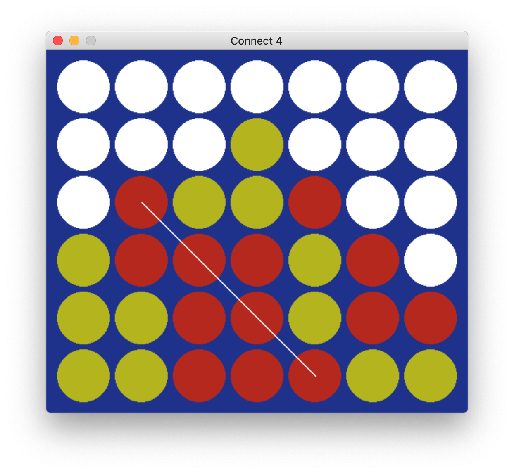
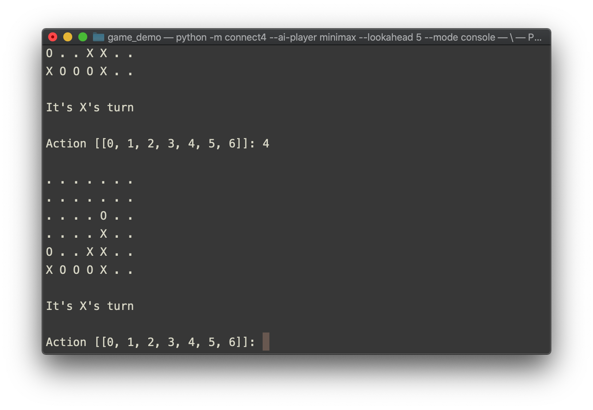
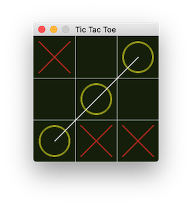
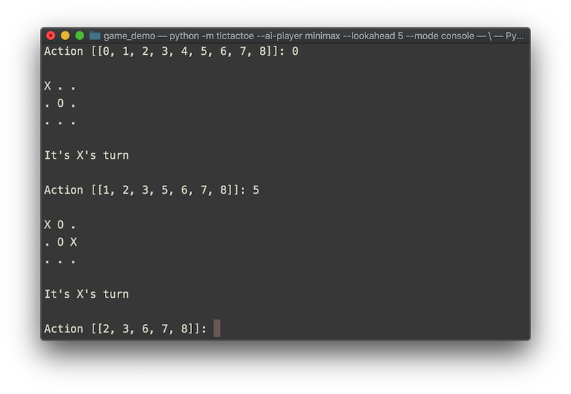

# Simple AI Games

This project demonstrates a simple example hot to train neural networks 
that can play simple games like TicTacToe and Connect 4.

## Setup

Clone repository and change to the cloned source dir.

    git clone https://github.com/macoun/simple-ai-games.git
    cd simple-ai-games

Create and source a virtual env. (Example for macos/linux)

    python3 -m venv --prompt venv venv
    source venv/bin/activate

Install requirements.

    pip install -r requirements.txt

## Play Connect 4

The entry point is _connect4.py_.

    python -m connect4

This will start a gui game with a trained AI (neural network) player.

To play the game in your terminal, use the `--mode console` option.

    python -m connect4 --mode console

## Play TicTacToe

The entry point is _tictactoe.py_.

    python -m tictactoe

This will start a gui game with a trained AI (neural network) player.

To play the gamein your terminal, use the `--mode console` option.

    python -m connect4 --mode console

## Configuring AI Players

The following configurations applies for both, connect4 and tictactore games.

### Neural Network Player

To play against a NN player, you can use the option `--player nn`.

    python -m connect4 --player nn

Since this is the default player, you don't need to specify it explicitly.

The NN player is trained with a default number (10000) of simulated plays. 

To change the simulated play count, use the `--simulations` option.

    python -m connect4 --simulations 40000

or similarly for tictactoe

    python -m tictactoe --simulations 40000

To change the default number of epochs for training, use the `--epochs` option.

    python -m connect4 --simulations 40000 --epochs 2

The above example can take a couple of minutes to train, 
but the result is a pretty challanging Connect 4 game.

### MiniMax Player

The minimax player uses the minimax algorithm to find the next 
best moves by traversing a tree of game states. 

To play against a minimax player, use the option `--player minimax`.

    python -m connect4 --player minimax

To specify how deep to traverse the tree before deciding 
which move to choose, use the `--lookahead` option.

    python -m connect4 --player minimax --lookahead 5

The minimax players can play almost perfect games if you 
set the `lookahead` high enough.

You can simulate multiple games with `NNPlayer` vs. `MiniMaxPlayer` 
players to check how well your model is playing against
a challenging opponent.

You will quickly notice that using minimax will take some time,
especially with connect4. 

We could accelerate the algorithm by applying 
_alpha/beta pruning_ to some branches in the state tree,
but it won't make this kind of games significantly faster
if we don't use heuristics. Otherwise, we need to build 
the entire possible game tree down to the last leaf nodes 
(game over state) in order to identify the winner. 

... or we can use a NN player ;)

